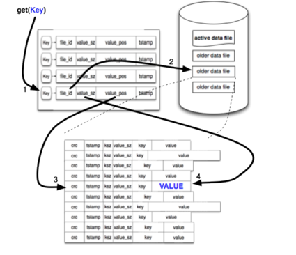

# 数据库开源项目RoseDB学习总结

首先感谢开源项目的作者Rose，0-1的完成了一个可用的数据库项目供大家学习研究，这是非常难得的。

## 项目介绍
简单来说，rosedb 是一个稳定、快速、内嵌的 NoSQL 数据库，支持多种数据结构，包含 `String`、`List`、`Hash`、`Set`、`Sorted Set`，整体使用体验类似于我们常用的Redis。
当前项目已经完成了基本的功能，可以作为一个学习项目，但还不适合放到生产环境去使用。下面我们从设计及代码实现等角度分析下该项目，并掺杂了一些本人的一些理解，
希望能够帮助大家更好的理解数据库RoseDB设计理念和实现细节，如有不对之处，欢迎指正。

## 设计理念
RoseDB的设计模型主要参考BitCask，BitCask存储设计使用LSM（Log Structure Merge），但索引没有使用LSM tree，而是用的Hash Table获取更高的性能，
下面一张图可以很好的说明BitCask的设计模型：

通过key获取value的过程：

1. 通过key计算hash值，然后通过hash值获取对应的文件id及offset
2. 通过文件id获取对应的文件，然后通过offset获取value

其中每个hash值是等长的，文件中每条记录是不等长的，但有一个等长的header，header中包含了key的长度，value的长度，以及value的crc32校验码。

## 代码实现
go语言实现，代码质量不错，结构也比较清晰，数据库系统多数基本都分为两层，应用层、存储引擎层。

1. 应用层: 提供redis协议的服务，并完成入参解析及校验，调用存储引擎层的接口，返回结果。

    redis协议服务主要基于开源项目[redcon](github.com/tidwall/redcon), 这块涉及的网络线程模型部分应该也是整体DB服务的一个重点，有兴趣可以去了解，不是本文重点。

2. 存储引擎层：LSM实现，HashTable索引及锁的实现，并基于LSM+HashTable索引完成对 String、List、Hash等不同Value数据结构的各种操作实现。
    
    HashTable的实现基于开源项目[go-adaptive-radix-tree](github.com/plar/go-adaptive-radix-tree), ART的实现是否能解决hash索引在多键值，不适合磁盘存储上的问题呢，
    这个问题我还没有深入研究，有兴趣的可以去了解下。
    
    String、List、Hash、Set等数据结构的实现，相对比较简单，而Sorted Set的实现相对复杂一些。
    
    
    
   